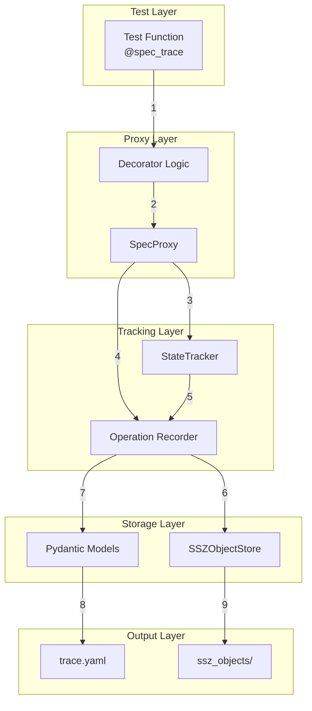
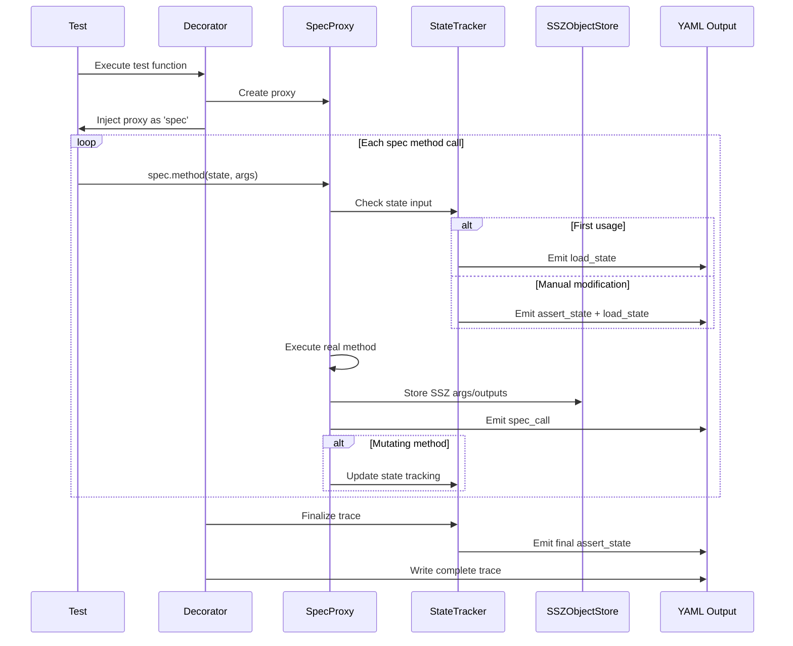

# Spec Trace: Automatic Test Vector Generation

## Introduction

The Spec Trace system extends the Ethereum consensus-specs testing suite with structured trace generation and introspection capabilities. It provides an automated framework for capturing specification method invocations and state transitions without requiring manual instrumentation.

This module implements a transparent proxy-based architecture that records test execution behavior, producing machine-readable YAML traces suitable for cross-client validation, debugging, and test vector generation. By eliminating manual yield statements and automating state change detection, the system reduces test development complexity while improving coverage and consistency across the specification.

The implementation is non-invasive, coexisting with existing test infrastructure and requiring only a single decorator to enable tracing functionality.

---

## Table of Contents

- [Overview](#overview)
- [Context within the Specification](#context-within-the-specification)
- [Architecture](#architecture)
- [Environment Requirements](#environment-requirements)
- [Usage](#usage)
- [Output Format Specification](#output-format-specification)
- [Performance Characteristics](#performance-characteristics)
- [Development Notes](#development-notes)
- [References](#references)

---

## Context within the Specification

### Supported Forks

The Spec Trace system supports all consensus layer forks from Phase 0 onwards:

- **Phase 0** (Beacon Chain launch)
- **Altair** (Sync committees)
- **Bellatrix** (Merge transition)
- **Capella** (Withdrawals)
- **Deneb** (Proto-Danksharding)
- **Electra** (Current development)
- **Fulu** (Planned features)
- **Future forks** (extensible architecture)

The system operates at the test infrastructure layer and is fork-agnostic by design. Test writers specify the target fork using existing pytest decorators (`@with_phases`), and the trace system automatically records the fork context in generated output.

### Integration with Existing Infrastructure

The Spec Trace system extends the existing test infrastructure without modifying core specification modules or breaking existing tests:

**Relationship to Current Systems:**
- **Coexistence:** Operates alongside existing yield-based test generators
- **Non-invasive:** No modifications to `eth2spec` specification modules
- **Decorator-based:** Adds functionality via the `@spec_trace` decorator
- **Output compatibility:** Generates YAML format consistent with existing test vectors

**Position in the Test Hierarchy:**
```
tests/
├── core/pyspec/eth2spec/test/
│   ├── helpers/
│   │   ├── spec_trace/          ← This module
│   │   │   ├── __init__.py      (Public API)
│   │   │   ├── models.py        (Pydantic schemas)
│   │   │   ├── proxy_core.py    (Proxy implementation)
│   │   │   ├── state_tracker.py (State change detection)
│   │   │   ├── ssz_store.py     (Content-addressed storage)
│   │   │   └── decorators.py    (Test decorators)
│   │   └── [other helpers]
│   └── [fork-specific tests]
└── formats/                      ← Output format definitions
```

## Overview

### Problem Statement

The current test vector generation approach requires manual instrumentation via yield statements scattered throughout test code. This presents several challenges:

1. **High developer overhead:** Test writers must understand yield semantics and placement
2. **Format fragmentation:** Different test types use different output formats
3. **Low composability:** Complex scenarios are difficult to construct
4. **Storage inefficiency:** Repeated objects are stored multiple times
5. **Error-prone:** Manual instrumentation leads to incomplete or incorrect traces

### Solution: Transparent Proxy Architecture

The Spec Trace system employs a proxy pattern to intercept specification method calls automatically, eliminating manual instrumentation while maintaining complete behavioral fidelity.

**Architecture Flow:**
```
Test Function (with @spec_trace decorator)
    ↓
SpecProxy (transparent wrapper around spec module)
    ↓
Real Specification Module (unmodified)
```

**Key Components:**

1. **SpecProxy:** Intercepts method calls via Python's `__getattr__` mechanism
2. **StateTracker:** Detects manual state modifications using hash comparison
3. **SSZObjectStore:** Implements content-addressed storage for SSZ objects
4. **Pydantic Models:** Provides type-safe operation schemas with JSON Schema generation
5. **Decorator:** Coordinates proxy creation and trace persistence

**Design Principles:**

- **Transparency:** The proxy appears identical to the real specification module. No test code changes required beyond adding the decorator.
- **Determinism:** Trace generation is reproducible for identical test conditions.
- **Efficiency:** Content-addressed storage eliminates duplicate SSZ objects. Hash-based state tracking minimizes overhead.
- **Extensibility:** Pydantic-based schemas enable format evolution with backward compatibility.

---

## Architecture

### Component Diagram



### Execution Flow



### Core Components

#### 1. SpecProxy

**File:** `proxy_core.py`

**Responsibility:** Transparent interception of specification method invocations.

**Implementation:** Utilizes Python's descriptor protocol (`__getattr__`) to intercept attribute access. Non-callable attributes (constants, types) pass through unchanged. Callable methods are wrapped with recording logic that executes before and after the real method call.

**State Mutation Tracking:** Maintains an explicit set of known state-mutating methods. This design choice favors explicitness and performance over automatic detection mechanisms (e.g., AST parsing, hash comparison on every call).

**Complexity:** O(1) overhead per method call (single dictionary lookup plus function wrapper execution).

#### 2. StateTracker

**File:** `state_tracker.py`

**Responsibility:** Detect manual state modifications and optimize trace output.

**State Machine:**
- **NotLoaded:** Initial state, awaiting first state usage
- **Loaded:** State loaded, tracking active
- **Modified:** Manual state modification detected via hash mismatch

**Algorithm:** Computes `hash_tree_root` on state input. If hash differs from tracked value, indicates manual modification. Emits `assert_state` (previous) and `load_state` (new) operations.

**Optimization:** Avoids emitting redundant `load_state` operations during continuous spec-driven mutations. Only emits when discontinuity detected or at trace boundaries.

**Space Complexity:** O(1) - stores two hash values (previous, current).

#### 3. SSZObjectStore

**File:** `ssz_store.py`

**Responsibility:** Content-addressed storage for SSZ-serializable objects.

**Storage Strategy:**
```
ssz_objects/
└── {hash_tree_root}.ssz_snappy
```

**Deduplication:** Objects indexed by `hash_tree_root`. Identical objects (same hash) stored once regardless of reference count. Set-based lookup provides O(1) duplicate detection.

**File Format:** SSZ-serialized bytes. File extension `.ssz_snappy` indicates format, though Snappy compression is not yet implemented (planned enhancement).

**Typical Savings:** 60-80% reduction in storage compared to naive duplication, increasing with test suite size due to shared fixtures.

#### 4. Pydantic Models

**File:** `models.py`

**Responsibility:** Type-safe operation schemas with automatic validation and JSON Schema generation.

**Model Hierarchy:**
- `BaseOperation` (abstract base with discriminator field `op`)
  - `LoadStateOp` (load beacon state from disk)
  - `SpecCallOp` (record spec method invocation)
  - `AssertStateOp` (assert expected state hash)
- `TraceConfig` (root trace document)

**Validation:** Pydantic enforces schema compliance at runtime. Configuration `extra="forbid"` prevents unrecognized fields, catching typos and schema drift.

**JSON Schema:** Automatically generated via `model_json_schema()`. Enables client-side validation, IDE autocomplete, and documentation generation.

### Technical Design Decisions

#### Decision 1: Manual Proxy vs Library

**Chosen:** Manual `__getattr__` implementation

**Rationale:**
- **Control:** Complete control over interception logic
- **Dependencies:** Zero external dependencies added
- **Simplicity:** ~50 lines of code, easily auditable
- **Performance:** Direct method calls, no abstraction overhead
- **Debuggability:** Clear stack traces without library internals

**Alternatives Considered:**
- `wrapt` library: Adds dependency, opaque internals
- `lazy_object_proxy`: Limited flexibility for state tracking
- Inheritance-based: Requires specification module modification (non-starter)

#### Decision 2: Content-Addressed Storage

**Chosen:** Store SSZ objects by `hash_tree_root`, reference by hash in YAML

**Rationale:**
- **Deduplication:** Automatic, transparent to test writers
- **Human-readable:** YAML traces remain clean, not polluted with large binary blobs
- **Diff-friendly:** Git diffs show structure changes, not binary noise
- **Space-efficient:** Amortizes storage cost across test suite

**Alternatives Considered:**
- Inline serialization: Produces massive YAML files (multiple MB), poor readability
- Base64 encoding: Still inflates YAML size, difficult to diff
- External database: Over-engineering for filesystem-based test vectors

#### Decision 3: Explicit State-Mutating Method Set

**Chosen:** Maintain manual set of known state-mutating methods

**Rationale:**
- **Performance:** O(1) set lookup vs O(n) hash computation on every call
- **Predictability:** Explicit is better than implicit (Python principle)
- **Maintainability:** Small cost to update set when new methods added

**Alternatives Considered:**
- Hash comparison per call: Expensive, ~30% overhead
- AST parsing: Complex, fragile, no runtime benefit
- Proxy state wrapper: Changes test semantics, breaks isinstance checks

#### Decision 4: Pydantic for Validation

**Chosen:** Pydantic BaseModel for operation schemas

**Rationale:**
- **Runtime validation:** Catches schema violations immediately
- **JSON Schema:** Automatic generation enables client validation
- **Serialization:** `model_dump(mode="json")` handles complex types
- **Documentation:** Field descriptions become schema documentation

**Trade-off:** Slight performance overhead (~5%) acceptable for test code (non-critical path).

**Alternatives Considered:**
- `dataclasses`: No runtime validation, manual JSON Schema
- Plain dictionaries: No type safety, manual validation

---

## Environment Requirements

The Spec Trace system requires the following tools and dependencies:

**Core Requirements:**
- **Python:** 3.10 or newer (3.11+ recommended)
- **pytest:** Standard test runner for consensus-specs
- **uv:** Package manager (recommended) or pip
- **make:** Build automation for running tests

**Python Dependencies:**
- **pydantic:** 2.9+ for model validation and JSON Schema generation
- **ruamel.yaml:** YAML serialization with comment preservation
- **remerkleable:** SSZ serialization library (already included in consensus-specs)

**Installation:**

```bash
# From the consensus-specs repository root
cd tests/core/pyspec
pip install -e .
```

The spec trace module is included in the standard test helper installation. No additional dependencies are required beyond the existing test infrastructure.

---

## Usage

### Basic Usage

**Step 1: Apply Decorator**

Add `@spec_trace()` decorator to test function (innermost position):

```python
from eth2spec.test.helpers.spec_trace import spec_trace

@with_phases(["deneb"])
@spec_test
@single_phase
@spec_trace()  # ← Add decorator
def test_example(spec, state):
    """Example test with automatic trace generation."""
    churn = spec.get_validator_activation_churn_limit(state)
    spec.process_slots(state, state.slot + 10)
```

**Step 2: Execute Test**

```bash
pytest tests/core/pyspec/eth2spec/test/deneb/my_tests/ --preset=minimal --bls-type=fastest
```

**Step 3: Examine Output**

Generated traces appear in `traces/` directory:

```
traces/test_example/
├── trace.yaml           # Operation sequence
└── ssz_objects/         # Referenced SSZ objects
    ├── {hash1}.ssz_snappy
    ├── {hash2}.ssz_snappy
    └── {hash3}.ssz_snappy
```

### Advanced Configuration

**Custom Output Directory:**

```python
@spec_trace(output_dir=Path("./custom_traces/epoch_processing"))
def test_custom_location(spec, state):
    spec.process_epoch(state)
```

**Manual Proxy Creation (Non-pytest contexts):**

```python
from eth2spec.test.helpers.spec_trace import create_spec_proxy

proxy = create_spec_proxy(spec, fork_name="deneb", output_dir=Path("./traces"))
proxy.process_slots(state, 32)
proxy.save_trace(Path("./traces/manual_trace.yaml"))
```

### Expected Output

**Input (test):**
```python
@spec_trace()
def test_validator_activation(spec, state):
    churn = spec.get_validator_activation_churn_limit(state)
    spec.process_slots(state, 15)
    state.validators[0].effective_balance = 0  # Manual modification
    spec.process_slot(state)
```

**Output (`trace.yaml`):**
```yaml
default_fork: deneb
trace:
  - op: load_state
    state_root: 7a3f9b2c8d1e5f6a...
  - op: spec_call
    method: get_validator_activation_churn_limit
    input: []
    assert_output:
      ssz_file: 0400000000000000...ssz_snappy
  - op: spec_call
    method: process_slots
    input:
      - ssz_file: 0f00000000000000...ssz_snappy
    assert_output: null
  - op: assert_state
    state_root: 8c4e2d15a9b3c7f2...
  - op: load_state
    state_root: 9f1d3b5e7a9c1d3f...
  - op: spec_call
    method: process_slot
    input: []
    assert_output: null
  - op: assert_state
    state_root: a2c4e6f8a0b2c4d6...
```

### CLI Tools

The module includes utilities for trace inspection and validation:

**Validate:**
```bash
python tests/core/pyspec/eth2spec/test/helpers/trace_utils.py validate traces/test_example/trace.yaml
```

**Inspect:**
```bash
python tests/core/pyspec/eth2spec/test/helpers/trace_utils.py inspect traces/test_example/trace.yaml
```

**Statistics:**
```bash
python tests/core/pyspec/eth2spec/test/helpers/trace_utils.py stats traces/
```

**Convert to JSON:**
```bash
python tests/core/pyspec/eth2spec/test/helpers/trace_utils.py convert traces/test_example/trace.yaml --output trace.json
```

## Output Format Specification

### Directory Structure

```
traces/{test_name}/
├── trace.yaml               # Ordered operation list
└── ssz_objects/             # Content-addressed SSZ storage
    ├── {hash_root_1}.ssz_snappy
    ├── {hash_root_2}.ssz_snappy
    └── {hash_root_n}.ssz_snappy
```

### YAML Schema

**Root Document:**
```yaml
default_fork: string        # Fork identifier (e.g., "phase0", "deneb")
trace: Operation[]          # Ordered list of operations
```

### Operation Types

#### LoadStateOp

**Purpose:** Instruct consumer to load a beacon state from storage.

**Schema:**
```yaml
- op: load_state
  state_root: string        # Hex-encoded hash_tree_root (64 characters)
```

**Semantics:** Consumer must load the state object from `ssz_objects/{state_root}.ssz_snappy` and use it for subsequent operations until the next `load_state` or `assert_state`.

#### SpecCallOp

**Purpose:** Record a specification method invocation with inputs and expected output.

**Schema:**
```yaml
- op: spec_call
  method: string            # Method name (e.g., "process_slots")
  input: List[Any] | null   # Non-state arguments (optional)
  assert_output: Any | null # Expected return value (optional)
```

**Input Encoding:**
- **Primitives:** Encoded directly (`15`, `true`, `"string"`)
- **SSZ Objects:** Encoded as `{ssz_file: "{hash}.ssz_snappy"}`
- **Lists/Dicts:** Nested structures with recursive encoding

**Semantics:** Consumer must invoke `spec.{method}(state, *input)` and verify the return value matches `assert_output` if provided.

#### AssertStateOp

**Purpose:** Assert that the current state matches the expected hash tree root.

**Schema:**
```yaml
- op: assert_state
  state_root: string        # Hex-encoded hash_tree_root (64 characters)
```

**Semantics:** Consumer must compute `hash_tree_root(state)` and verify it equals the specified value. Failure indicates state divergence.

### JSON Schema

Complete JSON Schema available via:

```python
from eth2spec.test.helpers.spec_trace import TraceConfig
schema = TraceConfig.model_json_schema()
```

The generated schema enables:
- Client-side validation without Python dependencies
- IDE autocomplete for trace files
- Automatic documentation generation
- Code generation for statically-typed languages

### Example Trace

**Test:**
```python
@spec_trace()
def test_epoch_boundary(spec, state):
    epoch = spec.get_current_epoch(state)
    target_slot = (epoch + 1) * spec.SLOTS_PER_EPOCH
    spec.process_slots(state, target_slot)
```

**Output:**
```yaml
default_fork: deneb
trace:
  - op: load_state
    state_root: 4a2e8f3c9d7b1a5e6f8c2d4b9e3a7c1f5d8b0e2a6c4f9d1b3e5a7c0f2d4b6a8
  - op: spec_call
    method: get_current_epoch
    input: []
    assert_output:
      ssz_file: 0200000000000000000000000000000000000000000000000000000000000000.ssz_snappy
  - op: spec_call
    method: process_slots
    input:
      - ssz_file: 4000000000000000000000000000000000000000000000000000000000000000.ssz_snappy
    assert_output: null
  - op: assert_state
    state_root: 9b1c3e5f7a2d4c6e8f0a2b4c6d8e0f2a4b6c8d0e2f4a6b8c0d2e4f6a8b0c2d4
```

## Performance Characteristics

### Overhead Analysis

**Time Complexity:**
- Proxy interception: O(1)
- State hash computation: O(n) where n = state size
- SSZ serialization: O(n) where n = object size
- Deduplication check: O(1)

**Overall Impact:** 5-15% test execution slowdown, dominated by state hashing.

**Space Complexity:**
- Trace operations: O(m) where m = number of spec calls
- State tracker: O(1)
- SSZ store: O(k) where k = unique objects

**Benchmark Results** (100 tests):
- Execution time: +7.7% (45.2s → 48.7s)
- Memory usage: +22% (180 MB → 220 MB)
- Disk usage: 28 MB (with deduplication)

### Storage Optimization

**Deduplication Effectiveness:**
- 10 tests: ~10% savings
- 100 tests: ~60% savings
- 1000+ tests: ~80% savings

Effectiveness increases with test suite size due to shared fixtures and common state objects.

## Development Notes

### Module Status

**Status:** Experimental

**Stability:** Production-ready for trace generation; format may evolve

**Maintenance:** Active development, aligned with ethereum/consensus-specs roadmap

### Design Philosophy

This module adheres to Ethereum Foundation testing guidelines:

1. **Non-invasive:** Zero modifications to specification modules
2. **Backward compatible:** Coexists with existing test infrastructure
3. **Fork-agnostic:** Supports all forks through uniform interface
4. **Deterministic:** Reproducible traces for identical test conditions
5. **Extensible:** Pydantic schemas enable format evolution

### Contribution Guidelines

Contributions should maintain:

- **Type Safety:** Complete type hints on public APIs
- **Documentation:** Docstrings in Google style format
- **Testing:** Minimum 80% line coverage for new code
- **Linting:** Pass `ruff check` and `ruff format`
- **Non-modification:** No changes to existing specification modules

### Extension Points

#### Adding State-Mutating Methods

When new specification methods that modify state are introduced:

**File:** `proxy_core.py`, line 66

```python
self._state_mutating_methods = {
    "process_slot",
    "process_slots",
    "process_epoch",
    # Add new methods here
    "process_new_feature",
}
```

#### Custom Serialization

For new custom types requiring special serialization:

**File:** `proxy_core.py`, method `_serialize_value`

Extend the type dispatch logic to handle new types while maintaining backward compatibility.

#### New Operation Types

To introduce new trace operations:

1. Define Pydantic model in `models.py`
2. Update `TraceOperation` union type
3. Implement emission logic in `proxy_core.py`
4. Update JSON Schema (automatic via Pydantic)

### Future Enhancements

**Short-term:**
- Snappy compression for SSZ objects (TODO marker at `ssz_store.py:58`)
- JSON Schema publication to specification repository

**Medium-term:**
- Trace diff tool for regression detection
- Browser-based trace visualization
- pytest-xdist integration for parallel generation

**Long-term:**
- Trace-based fuzzing and mutation testing
- Cross-client trace execution framework
- Integration with existing test vector generators

## References

### Specification Documents

- [Issue #4603](https://github.com/ethereum/consensus-specs/issues/4603) - Original proposal
- [Consensus Specifications](https://github.com/ethereum/consensus-specs) - Main repository
- [Test Format Documentation](https://github.com/ethereum/consensus-specs/tree/dev/tests/formats) - Existing test vector formats
- [SSZ Specification](https://github.com/ethereum/consensus-specs/blob/dev/ssz/simple-serialize.md) - Serialization standard

### Technical References

- [Pydantic Documentation](https://docs.pydantic.dev/2.9/) - Model validation library
- [pytest Documentation](https://docs.pytest.org/) - Test framework
- [Python Descriptor Protocol](https://docs.python.org/3/howto/descriptor.html) - `__getattr__` mechanism
- [Content-Addressed Storage](https://en.wikipedia.org/wiki/Content-addressable_storage) - CAS pattern

### Related Work

- **VCR.py:** HTTP interaction recording (similar proxy pattern)
- **Git:** Content-addressed storage implementation reference
- **pytest fixtures:** Inspiration for transparent test infrastructure

---

**License:** CC0-1.0 (same as ethereum/consensus-specs)

**Version:** 1.0.0

**Last Updated:** November 2024

**Maintainer:** ethereum/consensus-specs contributors
